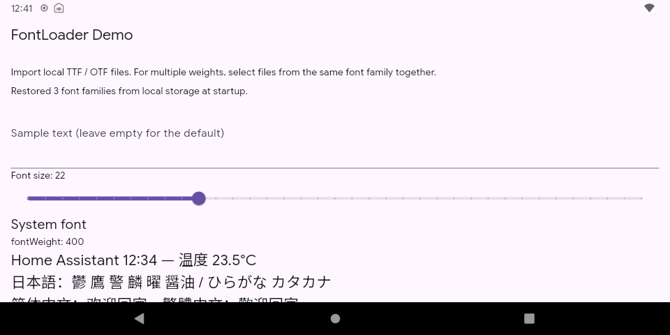
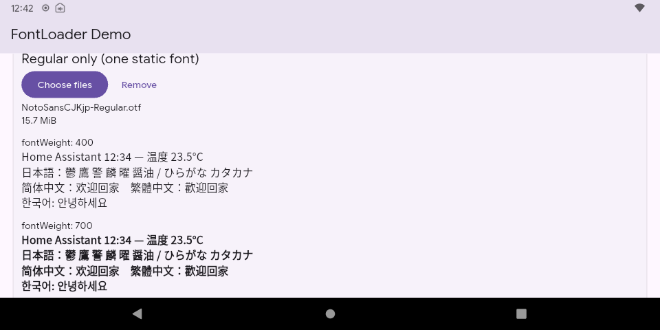
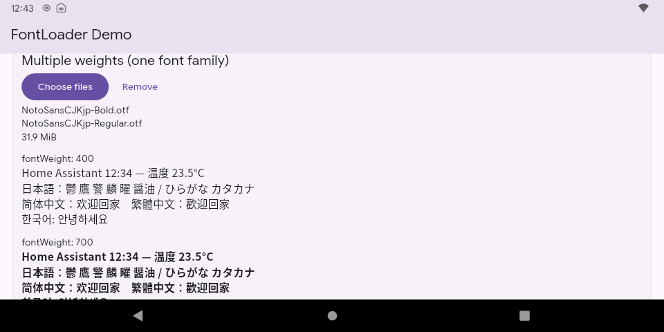
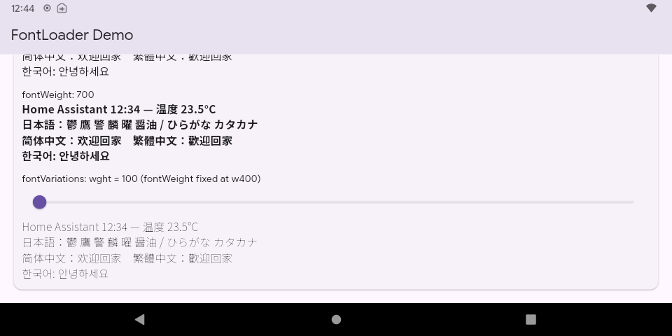
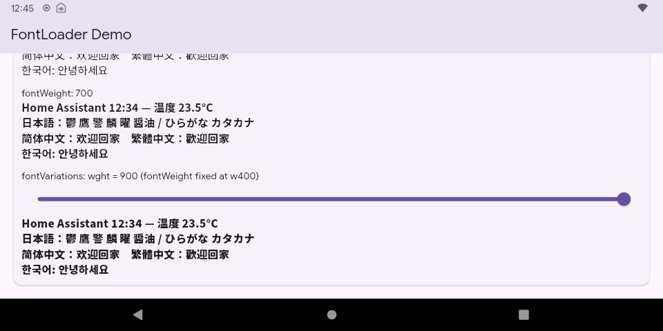

# Discussion screenshots

Unedited 960 × 480 screenshots from an Echo Show 5 (2nd Generation), running
Android 11 / API 30. The demo uses Flutter 3.44.6, a debug ARM 32-bit build,
and Noto Sans CJK JP. The Flutter debug banner is hidden.
The comparison screenshots use a font size of 16 logical pixels.

Upload the PNG files to the GitHub discussion and use the captions below.
Local relative links will not work in a discussion unless replaced with uploaded
image URLs or links to files published in a repository.

## Persistence

**Caption:** Three font families restored from app-local storage at startup.
Persistence was verified after force-stopping the app and moving both the original
font files and the file picker's cache away from their original paths.

## One static face versus multiple weights

**Caption:** Only Noto Sans CJK JP Regular is loaded. The same sample is rendered
with `FontWeight.w400` and `FontWeight.w700`.

**Caption:** Noto Sans CJK JP Regular and Bold are registered under one runtime
family using separate `FontLoader.addFont` calls. The sample at weight 700 looks
different from the Regular-only case. The exact selected face and synthetic-bold
behavior were not instrumented.

The bottom Korean line is partially clipped in the multiple-weights screenshot;
the Japanese and Chinese comparisons remain visible.

## Variable weight

**Caption:** Noto Sans CJK JP variable TTF with `FontVariation('wght', 100)`.
The lower sample uses a fixed `FontWeight.w400`; the upper sample is the separate
`FontWeight.w700` reference.

**Caption:** The same variable font and screen position with
`FontVariation('wght', 900)`. The lower sample visibly changes weight while the
upper reference remains unchanged.

## Source and test notes

- [Demo README](../../README.md)
- [UI and comparisons](../../lib/main.dart)
- [FontLoader and persistence](../../lib/font_store.dart)
- [Device test results](../RESULTS.md)

These observations concern this device and font set; they do not establish
behavior on older Android releases. Offline startup was not separately tested.
